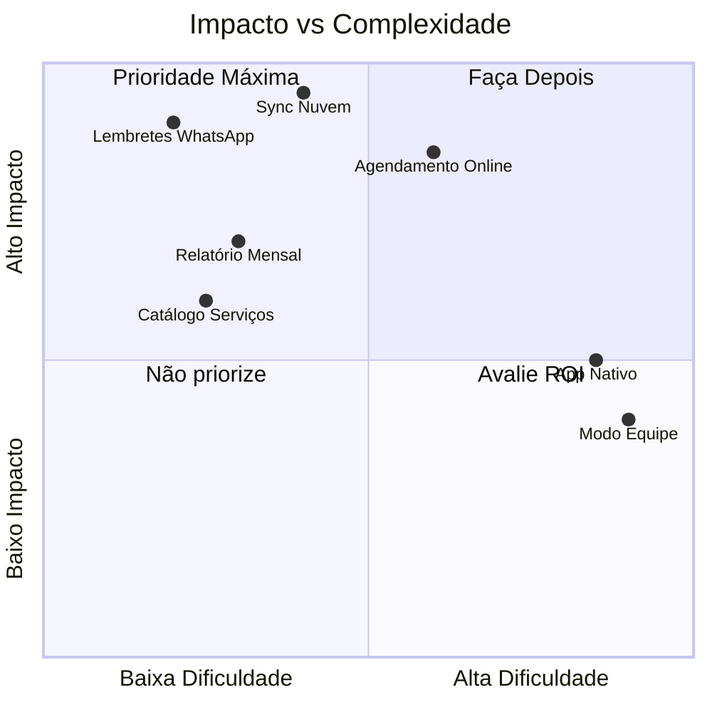

# Roadmap de Futuras Melhorias

Este documento contém um plano de melhorias prioritárias para agregar valor ao **Gerente de Bolso**.

---

## 🔥 Prioridade Alta (Alto Impacto / Implementação Simples)

| Melhoria | Descrição |
| :--- | :--- |
| **Lembretes por WhatsApp** | Integrar com a API oficial do WhatsApp Business para enviar lembretes automáticos de agendamentos para os clientes. Reduz faltas em até 40%. |
| **Sincronização em Nuvem** | Adicionar backend simples (Supabase ou Firebase) para sincronizar dados entre dispositivos e evitar perda de dados. |
| **Relatório Mensal Automático** | Gerar PDF de desempenho mensal (lucro, serviços, clientes novos) e notificar o usuário no início de cada mês. |
| **Pagamento Recorrente no Stripe** | Migrar de Payment Links para Stripe Subscriptions com webhooks, permitindo gerenciamento automático do status Pro. |

---

## 🚀 Prioridade Média (Alto Valor / Média Complexidade)

| Melhoria | Descrição |
| :--- | :--- |
| **Catálogo de Serviços Personalizável** | Permitir que o usuário crie "templates" de serviços com preços fixos, facilitando a criação de orçamentos. |
| **Agendamento Online (Link Público)** | Gerar um link público onde os clientes podem ver os horários disponíveis e solicitar agendamento. |
| **Galeria de Portfólio** | Permitir que o usuário faça upload de fotos de trabalhos realizados, vinculando ao cliente ou serviço. |
| **Metas e Gamificação** | Definir metas mensais (ex: R$ 5.000) e mostrar progresso visual. Adicionar badges de conquistas. |
| **Exportar para Excel** | Exportar clientes, agendamentos e finanças para planilha Excel para análise externa. |

---

## 💡 Prioridade Baixa (Nice-to-Have / Longo Prazo)

| Melhoria | Descrição |
| :--- | :--- |
| **Multi-Idiomas** | Suporte a Espanhol e Inglês para expansão internacional. |
| **App Nativo (Capacitor/Expo)** | Empacotar o PWA como app nativo para Play Store e App Store. |
| **Integração Google Calendar** | Sincronizar agendamentos com o Google Calendar do usuário. |
| **Modo Equipe** | Permitir múltiplos usuários (funcionários) em uma mesma conta empresarial. |
| **Relatórios Avançados de IA** | Usar o Gemini para gerar insights mensais sobre tendências do negócio. |

---

## 🛡️ Melhorias Técnicas (Qualidade e Manutenibilidade)

| Melhoria | Descrição |
| :--- | :--- |
| **Testes Unitários** | Adicionar cobertura de testes com Vitest para os serviços críticos. |
| **Migração para React Query** | Gerenciar cache e sincronização de dados de forma mais robusta. |
| **Validação com Zod** | Adicionar validação de schemas para todas as interfaces (Client, Appointment, etc.). |
| **Monitoramento de Erros** | Integrar Sentry para capturar erros de produção. |
| **CI/CD Automatizado** | Configurar GitHub Actions para build, lint e deploy automático. |

---

## ✅ Resumo de Impacto no Valor Percebido pelo Usuário

---

> [!TIP]
> Comece pelos itens de **Prioridade Alta**. Eles trazem o maior retorno com o menor esforço e aumentam significativamente a retenção de usuários.
